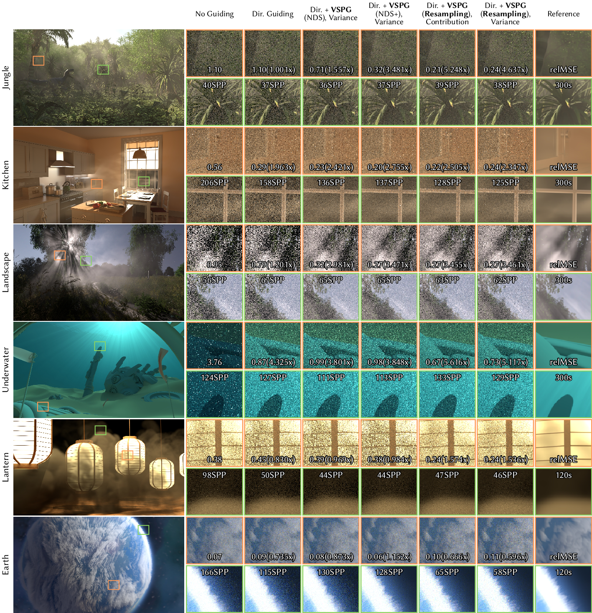

# Rendering scripts for the paper "Volume Scattering Probability Guiding"
### [Project Page](https://kehanxuuu.github.io/vspg-website/) | [Paper](https://kehanxuuu.github.io/vspg-website/static/pdfs/volume_scattering_probability_guiding_sa24.pdf) | [Renderer Code](https://github.com/kehanxuuu/vspg-pbrt-v4/) | [Scenes](https://drive.google.com/file/d/11mECG390H3CFszWaNu2i9QC87CDdTJAh/view?usp=sharing)



This repository contains scripts to generate the renderings in the paper and the [supplementary viewer](https://kehanxuuu.github.io/vspg-website/vspg-supplemental/index.html).

It is an extension of Sebastian Herholz's [rendering scripts](https://github.com/sherholz/rendering-scripts).

# Dependencies

``` bash
pip install simpleimageio opencv-python numpy
```

# Instructions

* Build and install the [renderer code](https://github.com/kehanxuuu/vspg-pbrt-v4/), then create a hyperlink in the root directory named `pbrt-renderer` pointing to the `install` folder.

* Download the [scenes](https://drive.google.com/file/d/11mECG390H3CFszWaNu2i9QC87CDdTJAh/view?usp=sharing), then create a hyperlink in the root directory named `pbrt-scenes` pointing to this folder.

* Run:
``` bash
# Equal-SPP experiments
PYTHONPATH=$PYTHONPATH:$PWD python3 runPBRTVSPGEqualSPP.py

# Equal-time experiments
PYTHONPATH=$PYTHONPATH:$PWD python3 runPBRTVSPGEqualTime.py
```